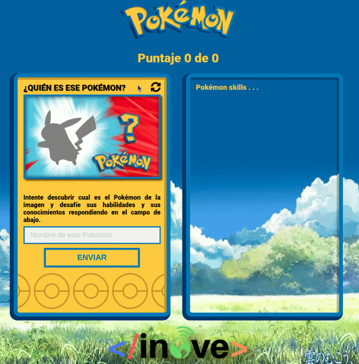

# PokeTrivia

## Release notes
Cambios y mejoras incorporadas en este release:
- Primera versión del proyecto.
- Se tiene una lista de pokemons en data.js.
- Crear la función "restart".
- Agregar evento de "click" sobre el boton de reset para cambiar el pokemon a mostrar a adivinar. Asociar el evento a la función "restart".

