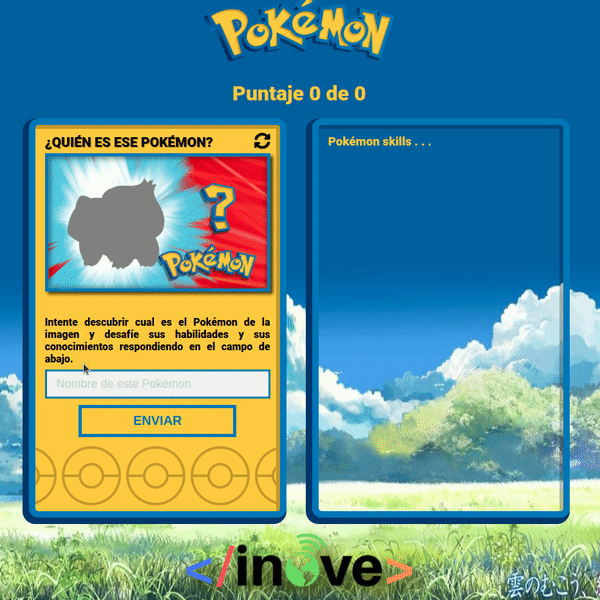

# PokeTrivia

## Release notes
Cambios y mejoras incorporadas en este release:
- Leer los datos desde la variable JSON "jsonData" en data.js.
- Crear un archivo "model.js", dentro definir un prototipo "Pokemon" que acepte "id" y "name". Dentro de ese prototipo se debe armar el "thumbnail" basado en el "id" (tal como se vio en clase).
- Parsear la variable "jsonData" y armar una lista de "pokemons" prototipo.
- Guardar en los datos de session (sessionStorage) las variables "cantidadAcertados" y "cantidadEncuestados" cada vez que son modificadas. Además, leer el valor de esas variables del "sessionStorage" cuando comienza app.js.

